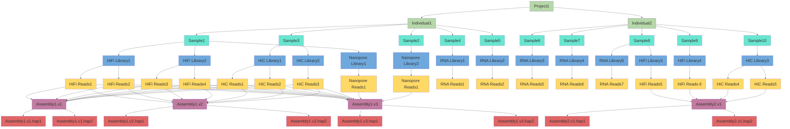

```mermaid

flowchart TD
    Project[Project1]:::Project --> Individual1[Individual1]:::Individual
    Project --> Individual2[Individual2]:::Individual
    
    Individual1 --> Sample1[Sample1]:::Sample
    Individual1 --> Sample2[Sample2]:::Sample
    Individual1 --> Sample3[Sample3]:::Sample
    Individual1 --> Sample4[Sample4]:::Sample
    Individual1 --> Sample5[Sample5]:::Sample
    
    Sample1 --> HiFiLibrary1[HiFi Library1]:::Library
    Sample1 --> HiFiLibrary2[HiFi Library2]:::Library
    Sample1 --> NanoporeLibrary1[Nanopore Library1]:::Library
    Sample2 --> NanoporeLibrary2[Nanopore Library2]:::Library
    
    Sample3 --> HiCLibrary1[HiC Library1]:::Library
    Sample3 --> HiCLibrary2[HiC Library2]:::Library
    Sample4 --> RNALibrary1[RNA Library1]:::Library
    Sample5 --> RNALibrary2[RNA Library2]:::Library

    HiFiLibrary1 --> HiFIReads1[HiFi Reads1]:::Reads 
    HiFiLibrary1 --> HiFIReads2[HiFi Reads2]:::Reads
    
    HiFiLibrary2 --> HiFIReads3[HiFi Reads3]:::Reads
    HiFiLibrary2 --> HiFIReads4[HiFi Reads4]:::Reads
    
    NanoporeLibrary1 --> NanoporeReads1[Nanopore Reads1]:::Reads
    NanoporeLibrary2 --> NanoporeReads2[Nanopore Reads1]:::Reads
    
    HiCLibrary1 --> HiСReads1[HiС Reads1]:::Reads 
    HiCLibrary1 --> HiСReads2[HiС Reads2]:::Reads
    HiCLibrary2 --> HiСReads3[HiС Reads3]:::Reads
    
    RNALibrary1[RNA Library1] -->  RNAReads1[RNA Reads1]:::Reads
    RNALibrary2[RNA Library2] -->  RNAReads2[RNA Reads2]:::Reads
    
    HiFIReads1 --> GenomeAssembly1.v1[Assembly1.v1]:::Assembly
    HiFIReads2 --> GenomeAssembly1.v1[Assembly1.v1]
    HiFIReads3 --> GenomeAssembly1.v1[Assembly1.v1]
    HiFIReads4 --> GenomeAssembly1.v1[Assembly1.v1]
    
    HiСReads1 --> GenomeAssembly1.v1[Assembly1.v1]
    HiСReads2 --> GenomeAssembly1.v1[Assembly1.v1]
    HiСReads3 --> GenomeAssembly1.v1[Assembly1.v1]
    
    HiFIReads1 --> GenomeAssembly1.v2[Assembly1.v2]:::Assembly
    HiFIReads2 --> GenomeAssembly1.v2[Assembly1.v2]
    HiFIReads3 --> GenomeAssembly1.v2[Assembly1.v2]
    HiFIReads4 --> GenomeAssembly1.v2[Assembly1.v2]
    
    HiСReads1 --> GenomeAssembly1.v2[Assembly1.v2]
    HiСReads2 --> GenomeAssembly1.v2[Assembly1.v2]
    HiСReads3 --> GenomeAssembly1.v2[Assembly1.v2]
    
    HiFIReads1 --> GenomeAssembly1.v3[Assembly1.v3]:::Assembly
    HiFIReads2 --> GenomeAssembly1.v3[Assembly1.v3]
    HiFIReads3 --> GenomeAssembly1.v3[Assembly1.v3]
    HiFIReads4 --> GenomeAssembly1.v3[Assembly1.v3]
    
    HiСReads1 --> GenomeAssembly1.v3[Assembly1.v3]
    HiСReads2 --> GenomeAssembly1.v3[Assembly1.v3]
    HiСReads3 --> GenomeAssembly1.v3[Assembly1.v3]
    
    NanoporeReads1 --> GenomeAssembly1.v3[Assembly1.v3]
    NanoporeReads2 --> GenomeAssembly1.v3[Assembly1.v3]
    
    GenomeAssembly1.v1[Assembly1.v1] --> GenomeAssembly1.v1.hap1[Assembly1.v1.hap1]:::Haplotype
    GenomeAssembly1.v1[Assembly1.v1] --> GenomeAssembly1.v1.hap2[Assembly1.v1.hap2]:::Haplotype
    GenomeAssembly1.v2[Assembly1.v2] --> GenomeAssembly1.v2.hap1[Assembly1.v2.hap1]:::Haplotype
    GenomeAssembly1.v2[Assembly1.v2] --> GenomeAssembly1.v2.hap2[Assembly1.v2.hap2]:::Haplotype
    GenomeAssembly1.v3[Assembly1.v3] --> GenomeAssembly1.v3.hap1[Assembly1.v3.hap1]:::Haplotype
    GenomeAssembly1.v3[Assembly1.v3] --> GenomeAssembly1.v3.hap2[Assembly1.v3.hap2]:::Haplotype
    
    Individual2 --> Sample6[Sample6]:::Sample
    Individual2 --> Sample7[Sample7]:::Sample
    Individual2 --> Sample8[Sample8]:::Sample
    Individual2 --> Sample9[Sample9]:::Sample
    Individual2 --> Sample10[Sample10]:::Sample
    
    Sample6 --> RNALibrary3[RNA Library3]:::Library
    Sample7 --> RNALibrary4[RNA Library4]:::Library
    Sample8 --> RNALibrary5[RNA Library5]:::Library
    Sample8 --> HiFiLibrary3[HiFi Library3]:::Library
    Sample9 --> HiFiLibrary4[HiFi Library4]:::Library
    Sample10 --> HiCLibrary3[HiC Library3]:::Library
    
    RNALibrary3[RNA Library3] --> RNAReads3[RNA Reads5]:::Reads
    RNALibrary4[RNA Library4] --> RNAReads4[RNA Reads6]:::Reads
    RNALibrary5[RNA Library5] --> RNAReads5[RNA Reads7]:::Reads
    HiFiLibrary3[HiFi Library3] --> HiFIReads5[HiFi Reads5]:::Reads
    HiFiLibrary4[HiFi Library4] --> HiFIReads6[HiFi Reads 6]:::Reads
    HiCLibrary3[HiC Library3] --> HiСReads4[HiС Reads4]:::Reads
    HiCLibrary3[HiC Library3] --> HiСReads5[HiС Reads5]:::Reads
    
    HiFIReads5 --> GenomeAssembly2.v1[Assembly2.v1]:::Assembly
    HiFIReads6 --> GenomeAssembly2.v1[Assembly2.v1]:::Assembly
    HiСReads4 --> GenomeAssembly2.v1[Assembly2.v1]:::Assembly
    HiСReads5 --> GenomeAssembly2.v1[Assembly2.v1]:::Assembly
    
    GenomeAssembly2.v1 --> GenomeAssembly2.v1.hap1[Assembly2.v1.hap1]:::Haplotype
    GenomeAssembly2.v1 --> GenomeAssembly2.v1.hap2[Assembly2.v1.hap2]:::Haplotype
    
    classDef Project fill:#b6d7a8,font-color:black,font-size:30
    classDef Individual fill:#b6d7a8,font-color:black,font-size:30
    classDef Sample fill:#68E6CF,font-color:black,font-size:30
    classDef Library fill:#6fa8dc,font-color:black,font-size:30
    classDef Reads fill:#ffd966,font-color:black,font-size:30
    classDef Assembly fill:#c27ba0,font-color:black,font-size:30
    classDef Haplotype fill:#e06666,font-color:black,font-size:30

```
