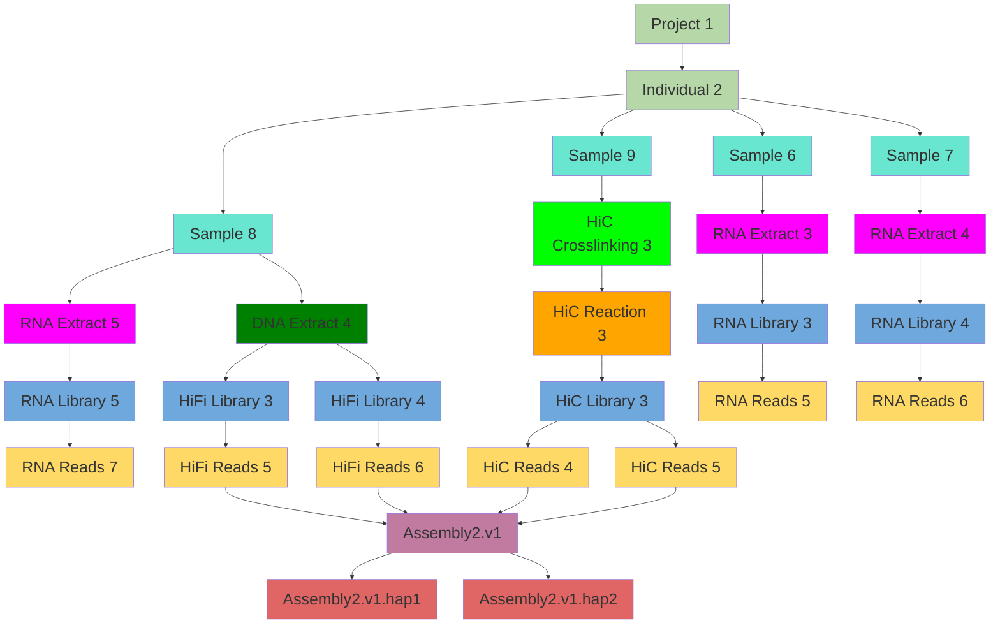

```mermaid

flowchart TD
    Project[Project 1]:::Project --> Individual1[Individual 1]:::Individual
    
    Individual1 --> Sample1[Sample 1]:::Sample
    Individual1 --> Sample2[Sample 2]:::Sample
    Individual1 --> Sample3[Sample 3]:::Sample
    Individual1 --> Sample4[Sample 4]:::Sample
    Individual1 --> Sample5[Sample 5]:::Sample
    
    Sample1 --> DNAExtract1[DNA Extract 1]:::DNAExtract
    Sample1 --> DNAExtract2[DNA Extract 2]:::DNAExtract
    Sample2 --> DNAExtract3[DNA Extract 3]:::DNAExtract
    Sample1 --> HiCCrosslinking1["HiC Crosslinking 1"]:::HiCCrosslinking 
    Sample3 --> HiCCrosslinking2["HiC Crosslinking 2"]:::HiCCrosslinking
    
    Sample4 --> RNAExtract1["RNA Extract 1"]:::RNAExtract
    Sample5 -->RNAExtract2["RNA Extract 2"]:::RNAExtract

    
    DNAExtract1 --> HiFiLibrary1[HiFi Library 1]:::Library
    DNAExtract2 --> HiFiLibrary2[HiFi Library 2]:::Library
    DNAExtract2 --> NanoporeLibrary1[Nanopore Library 1]:::Library
    DNAExtract3 --> NanoporeLibrary2[Nanopore Library 2]:::Library
    
    HiCCrosslinking1 --> HiCReaction1[HiC Reaction 1]:::HiCReaction
    HiCCrosslinking2 --> HiCReaction2[HiC Reaction 2]:::HiCReaction
    HiCReaction1 --> HiCLibrary1[HiC Library 1]:::Library
    HiCReaction2 --> HiCLibrary2[HiC Library 2]:::Library
    
    RNAExtract1 --> RNALibrary1[RNA Library 1]:::Library
    RNAExtract2 --> RNALibrary2[RNA Library 2]:::Library
    
    HiFiLibrary1 --> HiFIReads1[HiFi Reads 1]:::Reads 
    HiFiLibrary1 --> HiFIReads2[HiFi Reads 2]:::Reads
    
    HiFiLibrary2 --> HiFIReads3[HiFi Reads 3]:::Reads
    HiFiLibrary2 --> HiFIReads4[HiFi Reads 4]:::Reads
    
    NanoporeLibrary1 --> NanoporeReads1[Nanopore Reads 1]:::Reads
    NanoporeLibrary2 --> NanoporeReads2[Nanopore Reads 1]:::Reads
    
    HiCLibrary1 --> HiСReads1[HiС Reads 1]:::Reads 
    HiCLibrary1 --> HiСReads2[HiС Reads 2]:::Reads
    HiCLibrary2 --> HiСReads3[HiС Reads 3]:::Reads
    
    RNALibrary1[RNA Library 1] --> RNAReads1[RNA Reads 1]:::Reads
    RNALibrary2[RNA Library 2] --> RNAReads2[RNA Reads 2]:::Reads
    
    HiFIReads1 --> GenomeAssembly1.v1[Assembly1.v1]:::Assembly
    HiFIReads2 --> GenomeAssembly1.v1[Assembly1.v1]
    HiFIReads3 --> GenomeAssembly1.v1[Assembly1.v1]
    HiFIReads4 --> GenomeAssembly1.v1[Assembly1.v1]
    
    HiСReads1 --> GenomeAssembly1.v1[Assembly1.v1]
    HiСReads2 --> GenomeAssembly1.v1[Assembly1.v1]
    HiСReads3 --> GenomeAssembly1.v1[Assembly1.v1]
    
    HiFIReads1 --> GenomeAssembly1.v2[Assembly1.v2]:::Assembly
    HiFIReads2 --> GenomeAssembly1.v2[Assembly1.v2]
    HiFIReads3 --> GenomeAssembly1.v2[Assembly1.v2]
    HiFIReads4 --> GenomeAssembly1.v2[Assembly1.v2]
    
    HiСReads1 --> GenomeAssembly1.v2[Assembly1.v2]
    HiСReads2 --> GenomeAssembly1.v2[Assembly1.v2]
    HiСReads3 --> GenomeAssembly1.v2[Assembly1.v2]
    
    HiFIReads1 --> GenomeAssembly1.v3[Assembly1.v3]:::Assembly
    HiFIReads2 --> GenomeAssembly1.v3[Assembly1.v3]
    HiFIReads3 --> GenomeAssembly1.v3[Assembly1.v3]
    HiFIReads4 --> GenomeAssembly1.v3[Assembly1.v3]
    
    HiСReads1 --> GenomeAssembly1.v3[Assembly1.v3]
    HiСReads2 --> GenomeAssembly1.v3[Assembly1.v3]
    HiСReads3 --> GenomeAssembly1.v3[Assembly1.v3]
    
    NanoporeReads1 --> GenomeAssembly1.v3[Assembly1.v3]
    NanoporeReads2 --> GenomeAssembly1.v3[Assembly1.v3]
    
    GenomeAssembly1.v1[Assembly1.v1] --> GenomeAssembly1.v1.hap1[Assembly1.v1.hap1]:::Haplotype
    GenomeAssembly1.v1[Assembly1.v1] --> GenomeAssembly1.v1.hap2[Assembly1.v1.hap2]:::Haplotype
    GenomeAssembly1.v2[Assembly1.v2] --> GenomeAssembly1.v2.hap1[Assembly1.v2.hap1]:::Haplotype
    GenomeAssembly1.v2[Assembly1.v2] --> GenomeAssembly1.v2.hap2[Assembly1.v2.hap2]:::Haplotype
    GenomeAssembly1.v3[Assembly1.v3] --> GenomeAssembly1.v3.hap1[Assembly1.v3.hap1]:::Haplotype
    GenomeAssembly1.v3[Assembly1.v3] --> GenomeAssembly1.v3.hap2[Assembly1.v3.hap2]:::Haplotype
    
    classDef Project fill:#b6d7a8,font-color:black,font-size:30
    classDef Individual fill:#b6d7a8,font-color:black,font-size:30
    classDef Sample fill:#68E6CF,font-color:black,font-size:30
    classDef DNAExtract fill:green,font-color:black,font-size:30
    classDef HiCCrosslinking fill:lime,font-color:black,font-size:30
    classDef HiCReaction fill:orange,font-color:black,font-size:30
    classDef RNAExtract fill:magenta,font-color:black,font-size:30
    classDef Library fill:#6fa8dc,font-color:black,font-size:30
    classDef Reads fill:#ffd966,font-color:black,font-size:30
    classDef Assembly fill:#c27ba0,font-color:black,font-size:30
    classDef Haplotype fill:#e06666,font-color:black,font-size:30

```

| Parent      | Entry              | Relations    | Template                 | Example              | 
|-------------|--------------------|--------------|--------------------------|----------------------|
| .           | Project            | .            | **YGG**XXX               | **YGG**001           | 
| Project     | Individual         | one-to-many  | **YGG**XXX**.IND**WW     | **YGG**001**.IND**01 |
| Individual  | Sample             | one-to-many  | **YGG**XXX_YY            | **YGG**001_01        |
| Sample      | DNA Extract        | one-to-many  | **YGG**XXX_YY**D**VV     | **YGG**001_01**D**02 |
| Sample      | RNA Extract        | one-to-many  | **YGG**XXX_YY**R**VV     | **YGG**001_02**R**03 |
| Sample      | HiC crosslinking   | one-to-many  | **YGG**XXX_YY**C**VV     | **YGG**001_03**C**01 |
| Sample      | HiC reaction       | one-to-many  | **YGG**XXX_YY**H**VV     | **YGG**001_03**H**02 |
| DNA Extract | PacBio library     | one-to-many  | **YGG**XXX_YY**L**VV     | **YGG**001_01**L**01 |
| DNA Extract | Illumina library   | one-to-many  | **YGG**XXX_YY**A**VV     | **YGG**001_01**A**01 |
| DNA Extract | Nanopore library   | one-to-many  | **YGG**XXX_YY**P**VV     | **YGG**001_01**P**01 |
| RNA Extract | RNA library        | one-to-many  | **YGG**XXX_YY**N**VV     | **YGG**001_02**N**01 |
| Library     | Reads              | one-to-many  | technology dependent     | technology dependent |
| Reads       | Assembly           | many-to-many | GenSpiWW<b>.v</b>Q       | LycPic1.v1           |
| Assembly    | Assembly haplotype | many-to-many | GenSpiWW**.v**Q**.hap**T | LycPic1.v1.hap1      |
